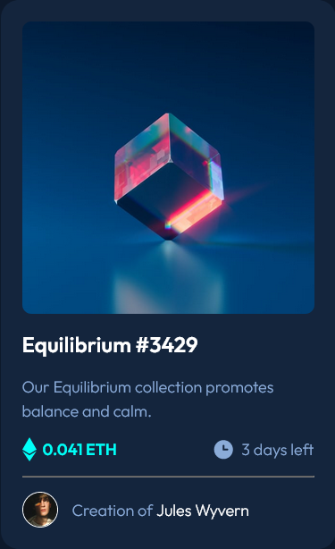

# Frontend Mentor - NFT preview card component solution

This is a solution to the [NFT preview card component challenge on Frontend Mentor](https://www.frontendmentor.io/challenges/nft-preview-card-component-SbdUL_w0U). Frontend Mentor challenges help you improve your coding skills by building realistic projects.

## Table of contents

-   [Overview](#overview)
    -   [The challenge](#the-challenge)
    -   [Screenshot](#screenshot)
    -   [Links](#links)
-   [My process](#my-process)
    -   [Built with](#built-with)
    -   [What I learned](#what-i-learned)
    -   [Useful resources](#useful-resources)
-   [Author](#author)

**Note: Delete this note and update the table of contents based on what sections you keep.**

## Overview

NFT Preview card solution

### The challenge

Users should be able to:

-   View the optimal layout depending on their device's screen size
-   See hover states for interactive elements

### Screenshot



### Links

-   Solution URL: [Add solution URL here](https://your-solution-url.com)

## My process

-   Started by outlining the HTML structure
-   Build the mobile view first
-   Applied CSS from top to bottom
-   Added hover styles later

### Built with

-   Semantic HTML5 markup
-   CSS custom properties
-   Flexbox
-   CSS Grid
-   Mobile-first workflow

### What I learned

I learned that img doesn't work with pseudo elements like ::after and ::before.

I learned how to create overlay on an image. In addition, learned about absolute positioning and how to center things with absolute position.

Some cool css that I learned.

```css
.coin__profile-overlay__eye {
    display: none;
    position: absolute;
    top: 50%;
    left: 50%;
    transform: translate(-50%, -50%);
    z-index: 2;
}
```

## Useful resources

-   [CSS Overlay](https://youtu.be/Himo9n0BaDw)

## Author

-   Frontend Mentor - [@yourusername](https://www.frontendmentor.io/profile/BinLama)
-   Twitter - [@yourusername](https://www.twitter.com/yourusername)

**Note: Delete this note and add/remove/edit lines above based on what links you'd like to share.**
